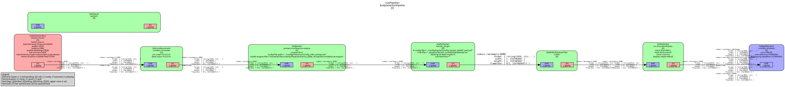

# LPR(Licence Plate Recognition)


## License Plate Recognition (Stage 1 — Vehicle Detection)

This project is the **first step** of a complete license plate recognition pipeline. It focuses on detecting **vehicles** in video streams using **YOLOv3-tiny** model integrated with the **NVIDIA DeepStream**. The modular design allows easy replacement or upgrading of the detection model (e.g., YOLOv4, YOLOv5, YOLOv8) for improved performance or accuracy. The pipeline includes inference, tracking, visualization, and optional RTSP streaming components — serving as the foundation for later stages such as license plate detection and character recognition.

<!-- --- -->

## Overview

The pipeline performs:
- **Vehicle detection** using YOLOv3-tiny TensorRT engine (`vehicle.engine`)
- **Tracking** via DeepStream’s NvDCF / SORT / DeepSORT trackers
- **Video stream handling** through GStreamer pipelines
- **RTSP streaming output** and optional local video file output
- **Modular management** of components: inference, tracker, tiler, OSD, and sink

This serves as the **foundation** for later stages such as license plate detection and OCR recognition.

<!-- --- -->

## Project Structure

```bash
licence_plate_recognition/
├── build/ # Compiled files and build artifacts
├── config/ # Configuration files
│ ├── addresses.txt
│ ├── configuration.json
│ ├── inference/ # YOLO and inference configs
│ └── tracker/ # Tracker configuration files
├── include/my_libraries/ # C++ headers for modular components
├── models/
│ └── vehicle.engine # YOLOv3-tiny TensorRT engine
├── plugins/ # Custom DeepStream plugin libraries
│ ├── car_libnvdsinfer_custom_impl_Yolo.so
│ ├── libnvdsgst_tracker.so
│ └── libnvds_nvmultiobjecttracker.so
├── src/ # C++ source files for pipeline modules
│ ├── main.cpp
│ ├── pipeline_manager.cpp
│ └── ...
├── CMakeLists.txt # Build configuration
└── README.md
```

<!-- --- -->

## Prerequisites

Before building, ensure you have the following installed, depending on DeepStream version:

- **Ubuntu 20.04 / 22.04**
- **CUDA Toolkit** (compatible with your GPU)
- **TensorRT** (for YOLO engine)
- **NVIDIA DeepStream SDK 6.x, 7.x, 8.0**
- **GStreamer (comes with DeepStream)**
- **CMake ≥ 3.10**
- **g++ ≥ 9.0**

<!-- --- -->

## Build Instructions
1. Clone the repository:
   ```bash
   git clone https://github.com/barzan-hayati/licence_plate_recognition.git
   cd licence_plate_recognition
   ```

2. Create and enter the build directory:
   ```bash
   mkdir -p build && cd build
   ```

3. Configure with CMake:
   ```bash
   cmake .. -DCMAKE_BUILD_TYPE=Release -DCMAKE_EXPORT_COMPILE_COMMANDS=ON
   ```

4. Compile:
   ```bash
   cmake --build . --config Release
   ```

The compiled binary will appear under:
```bash
build/bin/LPR
```

## Pipeline

The pipeline at this stage is as follows. Other pipelines, based on `display_output`, can be found in the `outputs` directory.




<!-- --- -->

## Run the Application

1. Add the paths to your video files or RTSP streams in the `addresses.txt` file


```bash
file:///home/lpr/Videos/lpr/day.mp4
```
or
```bash
rtsp://localhost:3081/mystream
```

2. Run the program:

```bash
cd build 
./bin/LPR
```

3. You can switch between output modes(sink) in the configuration file by changing `display_output`:

* `0`: `fake_sink` — does not display any output
* `1`: `display` — shows a window
* `2`: `file` — saves processed video
* `3`: `rtsp` — streams via RTSP

If you set `display_output` to `3` for RTSP output, you can view the processed video stream at the specified RTSP address"

```bash
rtsp://127.0.0.1:3087/rtsp-output
```

If you set `display_output` to `2` to save the processed video, the output file will be saved as `test.mkv`.


<!-- [▶️ Watch full demo video](./build/test.mkv) -->
<!-- [](https://drive.google.com/file/d/1yoSK9ttlaFib4FXOQuzaCs6T6-4u2viu/view?usp=sharing) -->
<!-- [ -->


<!-- --- -->

## Modular Components

Each stage of the DeepStream pipeline is encapsulated in a dedicated manager class:

| Component                 | File                         | Description                              |
| ------------------------- | ---------------------------- | ---------------------------------------- |
| OSD Manager               | `nv_osd_manager.*`           | Draws bounding boxes and labels          |
| Tracker Manager           | `nv_tracker_manager.*`       | Object tracking with NvDCF               |
| Pipeline Manager          | `pipeline_manager.*`         | Creates pipeline                          |
| Primary Inference Manager | `primary_nv_infer_manager.*` | Performs object detection                |
| RTSP streaming manager    | `rtsp_streaming_manager.*`   | outputs to rtsp streaming                 |
| Sink Manager              | `sink_manager.*`             | Outputs to file, RTSP, display window, or fake sink |
| Source bin Manager        | `source_bin.*`               | Creates uridecode bin                     |
| Streammux Manager         | `streammux_manager.*`        | Batches frames from multiple sources     |
| Tiler Manager             | `tiler_manager.*`            | Combines multiple streams for display    |

<!-- --- -->

## Configuration Details

* **`config/inference/car.cfg`** — YOLOv3-tiny network definition
* **`config/inference/car_names.txt`** — 3 classes names
* **`config/inference/config_infer_primary.txt`** — Primary inference engine configuration, like:

custom-network-config=car.cfg

num-detected-classes=3

model-engine-file=../../models/vehicle.engine

custom-lib-path=../../plugins/car_libnvdsinfer_custom_impl_Yolo.so
* **`config/addresses.txt`** — input video stream files or streams
* **`config/configuration.json`** — Runtime parameters (input source, sink type, etc.)
* **`config/tracker/config_tracker_NvDCF_perf.yml`** — Example tracker configuration
* **`models/vehicle.engine`** — TensorRT-optimized YOLO model

<!-- --- -->

## Extending the Model

You can replace `models/vehicle.engine` with another YOLO engine:

1. Train your YOLO model (e.g., YOLOv5 or YOLOv8)
2. Convert it to TensorRT engine using https://github.com/marcoslucianops/DeepStream-Yolo
3. Update `config/inference/car.cfg` and `config_infer_primary.txt` and `car_libnvdsinfer_custom_impl_Yolo.so`
4. Restart the pipeline — no code modification required

<!-- --- -->

<!-- ## License -->

<!-- This project is released under the **MIT License**. -->
<!-- Feel free to modify, extend, and integrate into your own DeepStream-based applications. -->
